# 🚀 Dynamic Pricing Adjustment with WebHooks

A FastAPI-based microservice that demonstrates real-time dynamic pricing adjustments using webhooks. This project simulates how e-commerce platforms can automatically adjust product prices based on market conditions, demand, and competitive pricing.

## 📋 Table of Contents

- [What are WebHooks?](#what-are-webhooks)
- [Project Overview](#project-overview)
- [System Architecture](#system-architecture)
- [Features](#features)
- [Installation & Setup](#installation--setup)
- [API Endpoints](#api-endpoints)
- [Usage Examples](#usage-examples)
- [Pricing Algorithm](#pricing-algorithm)
- [Testing](#testing)
- [Deployment](#deployment)
- [Contributing](#contributing)

## 🔗 What are WebHooks?

WebHooks are HTTP-based callback functions that enable real-time communication between different systems. Instead of continuously polling for updates, webhooks allow applications to receive instant notifications when specific events occur.

### Key Characteristics:
- **Event-Driven**: Triggered by specific events or data changes
- **Real-Time**: Instant notifications without polling delays
- **HTTP-Based**: Uses standard HTTP POST requests
- **Efficient**: Reduces server load compared to polling
- **Decoupled**: Enables loose coupling between systems

### Common Use Cases:
- Payment processing notifications
- CI/CD pipeline triggers
- Real-time data synchronization
- Dynamic pricing updates
- Inventory management alerts

## 🎯 Project Overview

This project implements a **Dynamic Pricing Adjustment System** that:

1. **Receives market data updates** via webhooks
2. **Processes pricing logic** using simulated AI algorithms
3. **Updates product prices** in real-time
4. **Provides APIs** for price retrieval and system health

### Project Structure

```
DynamicPricingAdjustment/
├── main.py                 # Main FastAPI application
├── requirements.txt        # Python dependencies
├── Dockerfile             # Container configuration
├── .gitignore            # Git ignore rules
├── .github/
│   └── workflows/
│       └── ci_cd_workflow.yml  # GitHub Actions CI/CD
├── tests/                 # Test files (to be created)
└── README.md             # This file
```

## 🏗️ System Architecture


### Data Flow Diagram


## ✨ Features

### Core Functionality
- ✅ **Webhook Processing**: Secure endpoint for market data updates
- ✅ **Dynamic Pricing**: AI-driven price adjustments based on market conditions
- ✅ **Real-time Updates**: Instant price modifications via webhooks
- ✅ **RESTful APIs**: Standard endpoints for price retrieval
- ✅ **Error Handling**: Comprehensive validation and error responses

### Technical Features
- ✅ **FastAPI Framework**: Modern, fast Python web framework
- ✅ **CORS Support**: Cross-origin resource sharing enabled
- ✅ **Structured Logging**: Detailed application logging
- ✅ **Health Monitoring**: System health check endpoint
- ✅ **Docker Support**: Containerized deployment
- ✅ **CI/CD Pipeline**: Automated testing and deployment

## 🚀 Installation & Setup

### Prerequisites
- Python 3.11+
- pip or conda
- Docker (optional)

### Local Development Setup

1. **Clone the repository**
   ```bash
   git clone <your-repo-url>
   cd DynamicPricingAdjustment
   ```

2. **Create virtual environment**
   ```bash
   python -m venv envDynPriceWH
   source envDynPriceWH/bin/activate  # On Windows: envDynPriceWH\Scripts\activate
   ```

3. **Install dependencies**
   ```bash
   pip install -r requirements.txt
   ```

4. **Run the application**
   ```bash
   python main.py
   ```

5. **Access the API**
   - API Documentation: http://localhost:8000/docs
   - Health Check: http://localhost:8000/health

### Docker Setup

1. **Build Docker image**
   ```bash
   docker build -t dynamic-pricing .
   ```

2. **Run container**
   ```bash
   docker run -p 8000:8000 dynamic-pricing
   ```

## 🛠️ API Endpoints

### Webhook Endpoints

#### POST `/webhook/market-update`
Receives market data updates and triggers price adjustments.

**Request Body:**
```json
{
  "product_id": "product1"
}
```

**Response:**
```json
{
  "product_id": "product1",
  "old_price": 100.0,
  "new_price": 105.5,
  "market_data": {
    "demand": 1.2,
    "competitor_price": 95.0,
    "trend": "rising"
  },
  "timestamp": "2025-08-29T10:30:00.123456"
}
```

### Pricing APIs

#### GET `/pricing/{product_id}`
Retrieve current pricing for a specific product.

**Response:**
```json
{
  "price": 105.5,
  "last_updated": "2025-08-29T10:30:00.123456"
}
```

#### GET `/pricing`
Retrieve all product pricing information.

### System APIs

#### GET `/health`
System health check endpoint.

**Response:**
```json
{
  "status": "healthy",
  "timestamp": "2025-08-29T10:30:00.123456"
}
```

## 📊 Pricing Algorithm

The dynamic pricing algorithm considers multiple market factors:

### Input Factors


### Algorithm Logic

1. **Base Adjustment**: `new_price = current_price × demand_multiplier`
2. **Trend Factor**: 
   - Rising market: `+10%`
   - Falling market: `-10%`
   - Stable market: `no change`
3. **Competitive Boundaries**: Keep price within `90%-110%` of competitor price

### Pricing Flow

```mermaid
flowchart TD
    A[Webhook Triggered] --> B[Get Market Data]
    B --> C[Current Price × Demand]
    C --> D{Market Trend?}
    D -->|Rising| E[Price × 1.1]
    D -->|Falling| F[Price × 0.9]
    D -->|Stable| G[No Trend Adjustment]
    E --> H[Apply Competitive Boundaries]
    F --> H
    G --> H
    H --> I[Update Database]
    I --> J[Return Response]
```



## 🧪 Usage Examples

### Testing the Webhook

1. **Start the server**
   ```bash
   python main.py
   ```

2. **Send a webhook request**
   ```bash
   curl -X POST "http://localhost:8000/webhook/market-update" \
        -H "Content-Type: application/json" \
        -d '{"product_id": "product1"}'
   ```

3. **Check updated pricing**
   ```bash
   curl "http://localhost:8000/pricing/product1"
   ```

### Integration Example

```python
import requests
import json

# Webhook payload
payload = {"product_id": "product1"}

# Send webhook
response = requests.post(
    "http://localhost:8000/webhook/market-update",
    json=payload,
    headers={"Content-Type": "application/json"}
)

if response.status_code == 200:
    result = response.json()
    print(f"Price updated: {result['old_price']} → {result['new_price']}")
else:
    print(f"Error: {response.status_code}")
```

## 🔒 Error Handling

The application implements comprehensive error handling:

### Validation Errors
- **400**: Invalid JSON format or missing fields
- **404**: Product not found
- **500**: Internal server errors

### Example Error Response
```json
{
  "detail": "Missing required field: product_id"
}
```

## 🧪 Testing

### Manual Testing

1. **Health Check**
   ```bash
   curl http://localhost:8000/health
   ```

2. **Get All Pricing**
   ```bash
   curl http://localhost:8000/pricing
   ```

3. **Trigger Price Update**
   ```bash
   curl -X POST http://localhost:8000/webhook/market-update \
        -H "Content-Type: application/json" \
        -d '{"product_id": "product1"}'
   ```

### Automated Testing (Future Enhancement)

Create test files in the `tests/` directory:
```python
# tests/test_webhooks.py
import pytest
from fastapi.testclient import TestClient
from main import app

client = TestClient(app)

def test_webhook_valid_request():
    response = client.post(
        "/webhook/market-update",
        json={"product_id": "product1"}
    )
    assert response.status_code == 200
    assert "new_price" in response.json()
```

## 🐳 Deployment

### Docker Deployment

```bash
# Build and run
docker build -t dynamic-pricing .
docker run -p 8000:8000 dynamic-pricing
```

### Production Considerations

1. **Environment Variables**: Store sensitive data in environment files
2. **Database**: Replace in-memory storage with persistent database
3. **Authentication**: Add API key validation for webhook security
4. **Rate Limiting**: Implement request rate limiting
5. **Monitoring**: Add application performance monitoring

## 🌟 Key Learning Concepts

### WebHook Best Practices Demonstrated

1. **Idempotency**: Safe to retry webhook calls
2. **Validation**: Strict input validation and error handling
3. **JSON Processing**: Proper content-type validation
4. **Logging**: Comprehensive request and error logging
5. **Response Format**: Consistent JSON response structure

### FastAPI Features Used

- **Automatic Documentation**: Built-in OpenAPI/Swagger docs
- **Type Hints**: Python type annotations for validation
- **Middleware**: CORS middleware for cross-origin requests
- **Exception Handling**: Custom HTTP exception handling
- **Async Support**: Asynchronous request processing

## 📈 Future Enhancements

- [ ] **Database Integration**: PostgreSQL/MongoDB for data persistence
- [ ] **Authentication**: JWT-based API authentication
- [ ] **Rate Limiting**: Request throttling and quota management
- [ ] **Machine Learning**: Real ML models for pricing decisions
- [ ] **Monitoring**: Prometheus metrics and Grafana dashboards
- [ ] **Testing**: Comprehensive unit and integration tests
- [ ] **Documentation**: Additional API documentation and examples

## 🤝 Contributing

1. Fork the repository
2. Create a feature branch (`git checkout -b feature/AmazingFeature`)
3. Commit your changes (`git commit -m 'Add some AmazingFeature'`)
4. Push to the branch (`git push origin feature/AmazingFeature`)
5. Open a Pull Request

## 📄 License

This project is licensed under the MIT License - see the [LICENSE](LICENSE) file for details.

## 🙋‍♂️ Support

If you have questions or need help:
- Open an issue on GitHub
- Check the API documentation at `/docs`
- Review the logs for debugging information

---

**Built with ❤️ using FastAPI and Python**